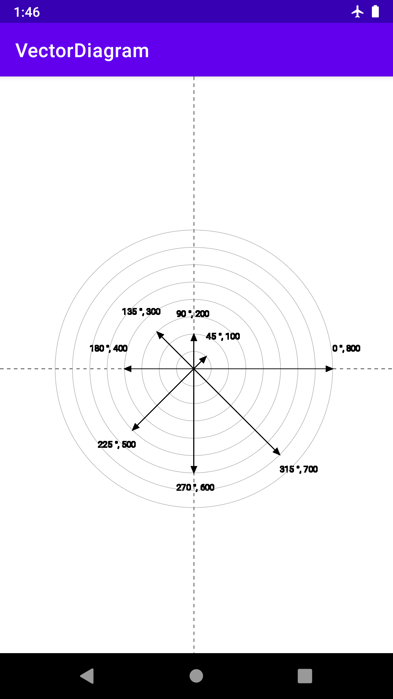

# VectorDiagram

Making Android custom vector diagram

You can add arrows with size and degree.

Circles will be added automatically when you add new arrows with size.

Pinch-to-zoom and scroll functions are also implemented.